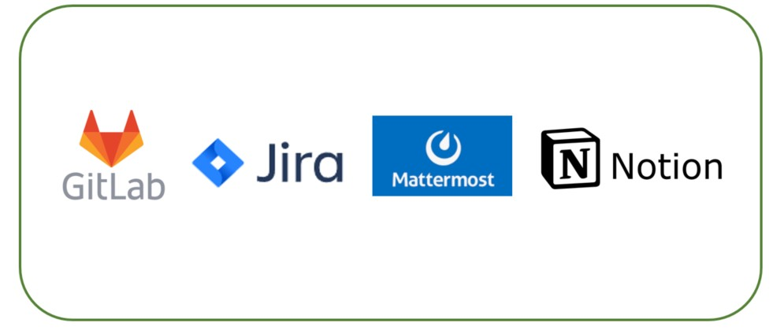

 

### 📜 목차

---

- [서비스 소개](#-서비스-소개)
- [기술 스택](#-기술-스택)
- [주요 기능](#-주요-기능)
- [세부 기능](#-세부-기능)
- [사용 예시](#-사용-예시)
- [아키텍쳐](#-아키텍쳐)
- [협업 관리](#-협업-관리)
- [팀원](#-팀원)

 

### 🌎 서비스 소개

##### 개발 기간 2022-10-10 ~ 2022-11-18 (약 7주)

---

**아이들이 자신들의 지구를 가꿀 수 있도록 저탄소 생활습관을 길러주세요!**

> 내가 Green 지구는 게이미피케이션을 통해 아이들의 저탄소 생활습관을 길러주고 탄소중립의 중요성을 알게 해주는 웹 교육 서비스입니다.
> 
> 환경오염이 점차 심각해짐에 따라 탄소 배출 감소 및 저탄소 생활화의 중요성이 대두되는 만큼 학령기 아이들에게 탄소 배출을 줄이는 생활 습관을 실천하게 함으로써 미래 탄소 배출 저감에 기여할 수 있습니다.
> 
> 아이들이 자신들의 지구를 지킬 수 있도록 도와주세요.

 

### 🛠 기술 스택

***

 

### 🚀 주요 기능

***

| 구분  | 기능           | 설명                                  | 비고  |
|:---:|:------------ |:----------------------------------- |:--- |
| 1   | 탄소 중립 교육 컨텐츠 | 아이들의 탄소 중립 개념 정립을 위한 컨텐츠 제공         |     |
| 2   | 저탄소 생활 습관 정립 | 게이미피케이션을 통한 저탄소 생활 습관 형성 가능         |     |
| 3   | 나의 지구 살리기    | 미션 및 게임 마일리지 적립을 통한 단계별 지구 업그레이드 가능 |     |
| 4   | 단체 채팅        | 보호자 회원과 함께 연결된 아동 회원 간 단체 채팅 가능     |     |

  

### 🛰 세부 기능

***

| 구분  | 기능            | 설명                                                                       | 비고  |
|:---:|:------------- |:------------------------------------------------------------------------ |:--- |
| 1   | 서비스 소개        | 서비스 배경 및 실제 서비스 내용 확인함                                                   |     |
| 2   | 서비스 사용 튜토리얼   | 서비스 사용 방법을 튜토리얼 형식으로 확인 가능함                                              |     |
| 3   | 소셜 회원가입 / 로그인 | 보호자 회원의 편리한 사용을 위해 카카오톡 회원 관리 기능 사용함                                     |     |
| 4   | 보호자 마이페이지     | 최대 5명의 아동 회원을 등록할 수 있고 연결된 아동 회원의 프로필 및 활동 내역을 확인하고 관리할 수 있음             |     |
| 5   | 아동 마이페이지      | 자신의 지구 레벨 및 미션, 뱃지 확인 가능 및 환경 게임 페이지로 이동 가능                              |     |
| 6   | 저탄소 생활 습관 미션  | 보호자 회원은 연결된 아동 회원에게 미션을 할당할 수 있음 아동 회원은 전달받은 미션을 확인하고 수행 후 승인 요청을 보냄 |     |
| 7   | 미션 보상 설정      | 보호자 회원은 연결된 아동 회원에게 실질적인 보상을 약속하고 아동 회원이 확인할 수 있음                        |     |
| 8   | 환상의 짝꿍        | 무작위로 섞인 카드의 짝을 맞추는 게임으로 저탄소 생활 습관 종류를 학습할 수 있음                           |     |
| 9   | 분리수거 왕        | 재활용 쓰레기를 드래그하는 게임으로 올바른 분리 수거 방법을 학습할 수 있음                               |     |
| 10  | 지구 특공대        | 틀린 그림 찾기 게임을 통해 일상 생활 속 에너지 낭비 모습을 찾고 올바른 저탄소 생활 모습을 학습할 수 있음            |     |
| 11  | 동요 세상         | 탄소 중립과 관련된 동요를 들으며 아동 회원들이 저탄소 생활에 흥미를 느낄 수 있게함                          |     |
| 12  | 단체 채팅         | 보호자 회원과 함께 연결된 아동 회원 간 단체 채팅 가능                                          |     |
| 13  | 배경 음악 on/off  | 서비스 배경 음악을 on / off 할 수 있음                                               |     |

 

### 🔎 아키텍쳐

***

 

### ERD

---

 

### 📅 협업 관리

---

- **GitLab** : 형상 관리
- **Jira** : 이슈 관리
- **MatterMost** : 소통
- **Notion** : 전체적인 일정 및 학습자료, 문서 관리

 

### 👨‍👩‍👦 팀원

***

<table>
 <tr>
 <td height="140px" align="center"> <a href="https://github.com/Gyeong10">
   박경열</a>   </td>
 <td height="140px" align="center"> <a href="https://github.com/rainbow77777">
   강지명</a>   </td>
 <td height="140px" align="center"> <a href="https://github.com/ict-cspark/">
   박찬석</a>   </td>
 <td height="140px" align="center"> <a href="https://github.com/3jieun3">
   박지은</a>   </td>
 <td height="140px" align="center"> <a href="https://github.com/jongil512">
   정종일</a>   </td>
 <td height="140px" align="center"> <a href="https://github.com/sskong777">
   홍석현</a>   </td>
 </tr>
 <tr>
 <td align="center">
 팀장/Front-End
 </td>
 <td align="center">
 팀원/Front-End
 </td>
 <td align="center">
 팀원/Front-End
 </td>
 <td align="center">
 팀원/Back-End
 </td>
 <td align="center">
 팀원/Back-End
 </td>
 <td align="center">
 팀원/Back-End
 </td>
 </tr>
</table>

 