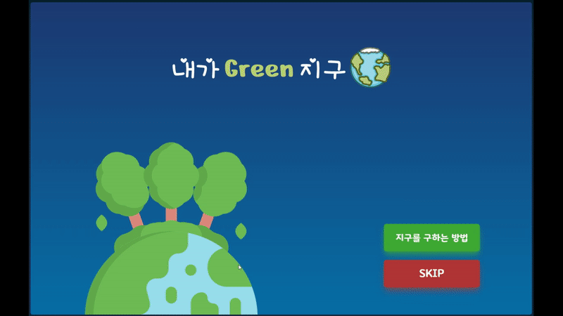
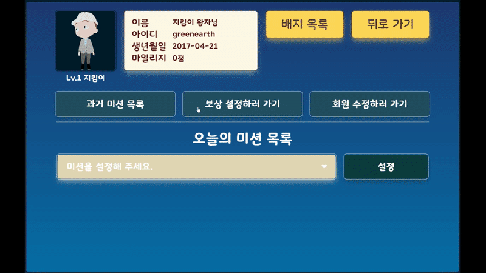
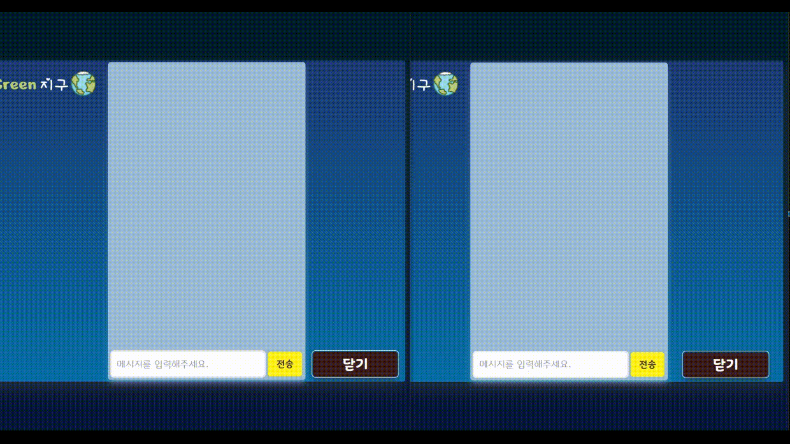
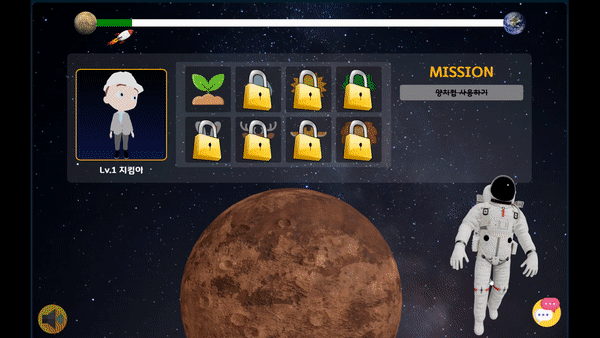
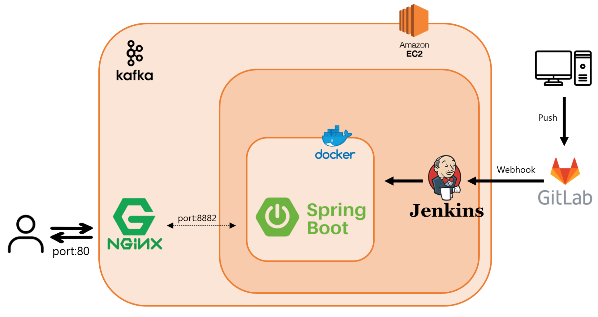
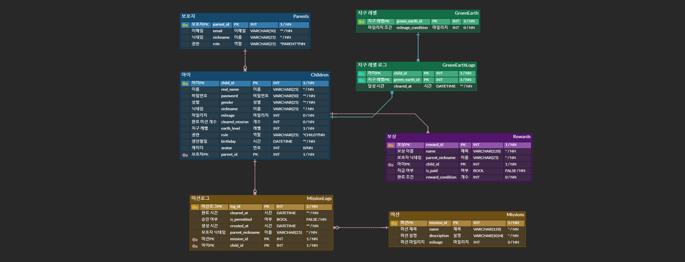

 

### 📜 목차

---

- [📜 목차](#-목차)

- [🌎 서비스 소개](#-서비스-소개)

- [🛠 기술 스택](#-기술-스택)

- [🚀 주요 기능](#-주요-기능)

- [🛰 세부 기능](#-세부-기능)

- [💻 사용 예시](#-사용-예시)

- [🔎 시스템 아키텍쳐](#-시스템-아키텍쳐)

- [📚 디렉터리 구조](#-디렉터리-구조)

- [🎨 개발 설계](#-개발-설계)

- [📅 산출물](#-산출물)

- [👨‍👩‍👦 팀원](#-팀원)

 

### 🌎 서비스 소개

##### 개발 기간 2022-10-10 ~ 2022-11-18 (약 7주)

---

**아이들이 자신들의 지구를 가꿀 수 있도록 저탄소 생활습관을 길러주세요!**

> 내가 Green 지구는 게이미피케이션을 통해 아이들의 저탄소 생활습관을 길러주고 탄소중립의 중요성을 알게 해주는 웹 교육 서비스입니다.
> 
> 환경오염이 점차 심각해짐에 따라 탄소 배출 감소 및 저탄소 생활화의 중요성이 대두되는 만큼 학령기 아이들에게 탄소 배출을 줄이는 생활 습관을 실천하게 함으로써 미래 탄소 배출 저감에 기여할 수 있습니다.
> 
> 아이들이 자신들의 지구를 지킬 수 있도록 도와주세요.

 

### 🛠 기술 스택

***

1. 이슈 관리 : Jira

2. 형상 관리 : Gitlab

3. 커뮤니케이션 : Mattermost, Notionm Webex

4. 개발 환경
   
   - OS : Window 10
   
   - DB : Mysql 8.0.31
   
   - Server : AWS EC2, Ubuntu 20.04.5, Jenkins 2.375, nginx 1.18.0

5. Front-End 상세
   
   - React 18.2.0
   
   - Recoil 0.7.6, React-stomp 5.1.0
   
   - Three.js 0.145.0

6. Back-End 상세
   
   - Java 11
   
   - Spring Boot Gradle 7.5
   
   - Lombok 1.18.20, Swagger2 3.0, jjwt 0.9.1
   
   - STOMP, Kafka 2.11-2.1.0

7- IDE & Tool
   
   - IntelliJ 22.1.3
   
   - Visual Strudio Code 1.70.1
   
   - MobaXterm 22.1

 

### 🚀 주요 기능

***

| 구분  | 기능           | 설명                                  | 비고  |
|:---:|:------------ |:----------------------------------- |:--- |
| 1   | 탄소 중립 교육 컨텐츠 | 아이들의 탄소 중립 개념 정립을 위한 컨텐츠 제공         |     |
| 2   | 저탄소 생활 습관 정립 | 게이미피케이션을 통한 저탄소 생활 습관 형성 가능         |     |
| 3   | 나의 지구 살리기    | 미션 및 게임 마일리지 적립을 통한 단계별 지구 업그레이드 가능 |     |
| 4   | 단체 채팅        | 보호자 회원과 함께 연결된 아동 회원 간 단체 채팅 가능     |     |

 

### 🛰 세부 기능

***

| 구분  | 기능            | 설명                                                                       | 비고  |
|:---:|:------------- |:------------------------------------------------------------------------ |:--- |
| 1   | 서비스 소개        | 서비스 배경 및 실제 서비스 내용 확인함                                                   |     |
| 2   | 서비스 사용 튜토리얼   | 서비스 사용 방법을 튜토리얼 형식으로 확인 가능함                                              |     |
| 3   | 소셜 회원가입 / 로그인 | 보호자 회원의 편리한 사용을 위해 카카오톡 회원 관리 기능 사용함                                     |     |
| 4   | 보호자 마이페이지     | 최대 5명의 아동 회원을 등록할 수 있고 연결된 아동 회원의 프로필 및 활동 내역을 확인하고 관리할 수 있음             |     |
| 5   | 아동 마이페이지      | 자신의 지구 레벨 및 미션, 뱃지 확인 가능 및 환경 게임 페이지로 이동 가능                              |     |
| 6   | 저탄소 생활 습관 미션  | 보호자 회원은 연결된 아동 회원에게 미션을 할당할 수 있음 아동 회원은 전달받은 미션을 확인하고 수행 후 승인 요청을 보냄 |     |
| 7   | 미션 보상 설정      | 보호자 회원은 연결된 아동 회원에게 실질적인 보상을 약속하고 아동 회원이 확인할 수 있음                        |     |
| 8   | 환상의 짝꿍        | 무작위로 섞인 카드의 짝을 맞추는 게임으로 저탄소 생활 습관 종류를 학습할 수 있음                           |     |
| 9   | 분리수거 왕        | 재활용 쓰레기를 드래그하는 게임으로 올바른 분리 수거 방법을 학습할 수 있음                               |     |
| 10  | 지구 특공대        | 틀린 그림 찾기 게임을 통해 일상 생활 속 에너지 낭비 모습을 찾고 올바른 저탄소 생활 모습을 학습할 수 있음            |     |
| 11  | 동요 세상         | 탄소 중립과 관련된 동요를 들으며 아동 회원들이 저탄소 생활에 흥미를 느낄 수 있게함                          |     |
| 12  | 단체 채팅         | 보호자 회원과 함께 연결된 아동 회원 간 단체 채팅 가능                                          |     |
| 13  | 배경 음악 on/off  | 서비스 배경 음악을 on / off 할 수 있음                                               |     |

 

### 💻 사용 예시

---

| 서비스 소개                    | 보호자 메인 페이지                         |
|:-------------------------:|:----------------------------------:|
|  |  |

| 아동 메인 페이지                   | 아동 프로필 페이지                         |
|:---------------------------:|:----------------------------------:|
|  |  |

| 미션 설정                                                                                                                                                  | 미션 상세 페이지                      |
|:------------------------------------------------------------------------------------------------------------------------------------------------------:|:------------------------------:|
|  |  |

| 보상 설정                     | 단체 채팅                  |
|:-------------------------:|:----------------------:|
|  |  |

| 환상의 짝꿍                       | 분리수거 왕                    |
|:----------------------------:|:-------------------------:|
|  |  |

| 지구 특공대                                                                                                                                                        | 동요 세상                    |
|:-------------------------------------------------------------------------------------------------------------------------------------------------------------:|:------------------------:|
|  |  |

 

### 🔎 시스템 아키텍쳐

***

|  |  |
| ---------------------------------------------------------------------- | -------------------------------------------------------- |

 

### 📚 디렉터리 구조

***

<table>
<tr>
<th>Front-End</th>
<th>Back-End</th>
<th>Chatting</th>
</tr>
<tr>
<td>
<pre><code>📦src
 ├─📁Model
 ├─📁components
 │  ├─📂ChattingPage
 │  ├─📂ChildMainPage
 │  ├─📂EditAccountPage
 │  ├─📂GamePage
 │  ├─📂LoginPage
 │  ├─📂ParentMainPage
 │  ├─📂ProfilePage
 │  ├─📂SignUpPage
 │  └─📂WelcomePage
 ├─📁functions
 ├─📁pages
 ├─📁store
 └─📁style
 │  ├─📂ChattingPage
 │  ├─📂ChildMainPage
 │  ├─📂LoginPage
 │  ├─📂MissionInfoPage
 │  ├─📂ParentMainPage
 │  ├─📂SignUpPage
 │  └─📂WelcomePage</code></pre>
</td>
<td>
<pre><code>📦main
 ├─📁java
 │ └─📁com
 │   └─📁ssafy
 │     └─📁greenEarth
 │        ├─📂config
 │        ├─📂controller
 │        ├─📂domain
 │        ├─📂dto
 │        │   ├─📂Auth
 │        │   ├─📂Game
 │        │   ├─📂Member
 │        │   ├─📂Mission
 │        │   └─📂Reward
 │        ├─📂exception
 │        ├─📂interceptor
 │        ├─📂jwt
 │        ├─📂repository
 │        ├─📂security
 │        └─📂service
 └─📁resources
</code></pre>
</td>
<td>
<pre><code>📦main
 ├─📁java
 │ └─📁com
 │   └─📁greenEarth
 │     └─📁chatting
 │        ├─📂config
 │        ├─📂controller
 │        ├─📂dto
 │        └─📂service
 └─📁resources
</code></pre>
</td>
</table>

 

### 🎨 개발 설계

---

1. ERD

2. [API docs](https://grandiose-latency-d37.notion.site/API-8e42ccd250bd464ea9d3a6c3a701b299)

 

### 👨‍👩‍👦 팀원

***

<table>
 <tr>
 <td height="140px" align="center"> <a href="https://github.com/Gyeong10">
   박경열</a>   </td>
 <td height="140px" align="center"> <a href="https://github.com/rainbow77777">
   강지명</a>   </td>
 <td height="140px" align="center"> <a href="https://github.com/ict-cspark/">
   박찬석</a>   </td>
 <td height="140px" align="center"> <a href="https://github.com/3jieun3">
   박지은</a>   </td>
 <td height="140px" align="center"> <a href="https://github.com/jongil512">
   정종일</a>   </td>
 <td height="140px" align="center"> <a href="https://github.com/sskong777">
   홍석현</a>   </td>
 </tr>
 <tr>
 <td align="center">
 팀장/Front-End
 </td>
 <td align="center">
 팀원/Front-End
 </td>
 <td align="center">
 팀원/Front-End
 </td>
 <td align="center">
 팀원/Back-End
 </td>
 <td align="center">
 팀원/Back-End
 </td>
 <td align="center">
 팀원/Back-End
 </td>
 </tr>
</table>

 
